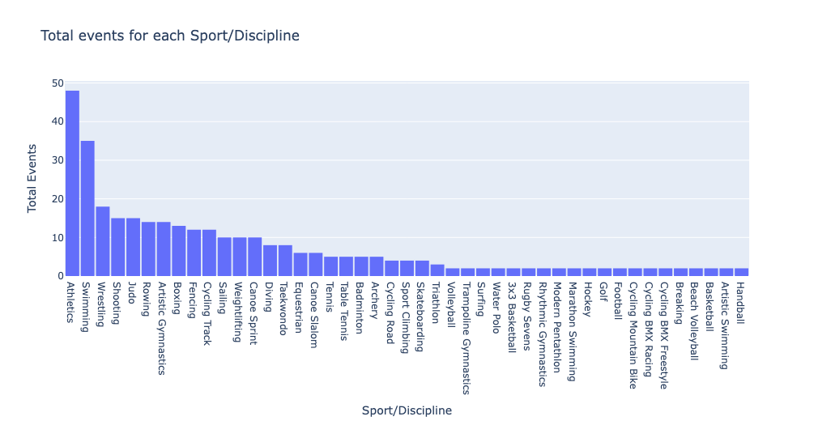
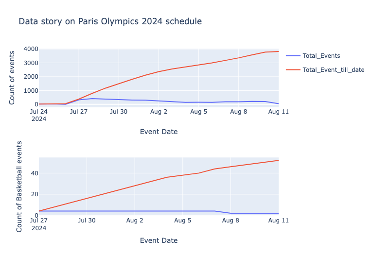
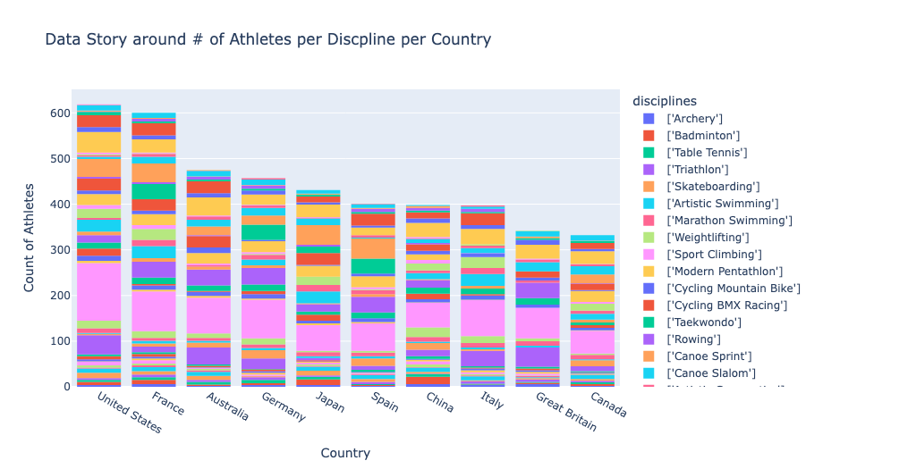
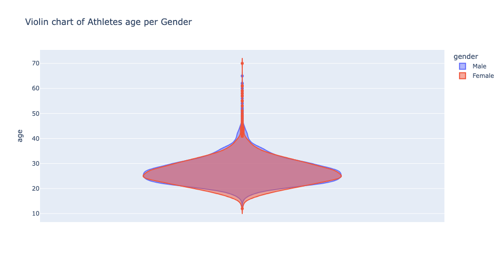
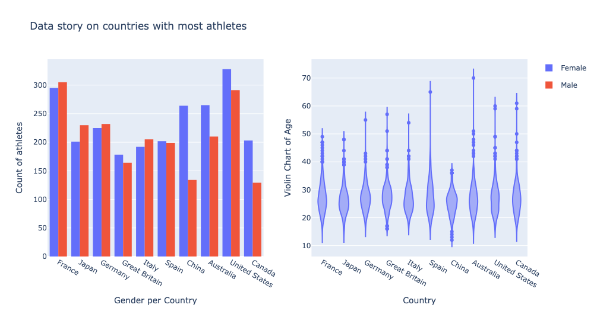
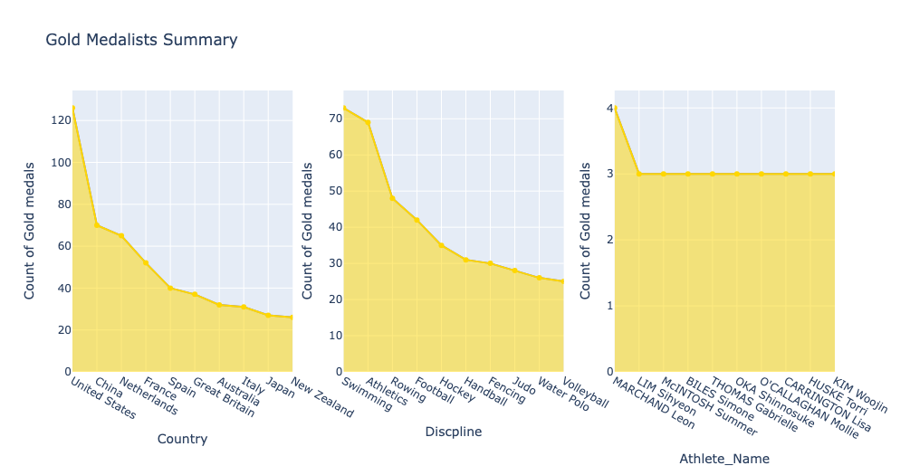
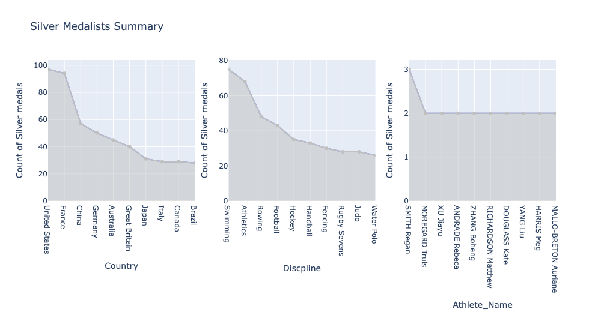
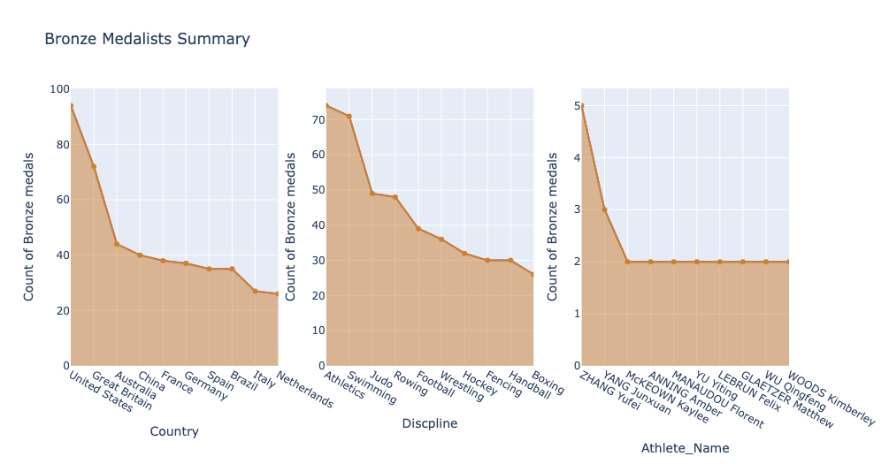
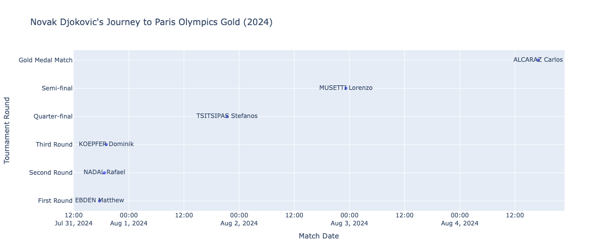

# Kaggle Paris2024 Olympics Data Storytelling
Data Story telling on Paris 2024 Olympics. Understand the data around Paris 2024 Olympics and visualize interesting findings.  
Kaggle Dataset - https://www.kaggle.com/datasets/piterfm/paris-2024-olympic-summer-games/data
  
Kaggle notebook - https://www.kaggle.com/code/kartikpradyumna92/data-story-telling-on-paris-2024-olympics
  

__*Conclusion Notes*__
This data was around the evnts and athletes part of Paris 2024 Olympics. I looked at it from few point of views (POV)

from Events POV  
      *      Ranked events based on the occurrence. Most events are Athletics events since it bins all track and field events, followed by swimming.

      

from Schedule POV
            Time series plot to see total events everyday and cumulative event to understand percentage completion each day.
            Comapred with Basketball event schedule and trend is highly correlated

from Overall Athletes POV 
            Identified that we had a 12 year and 70 year old athlete competiting,
            Most athletes are part of track and field discipline, followed by swimming, football.
            Gender parity is not a lot in top ten Countries in terms of total athletes representing their country but overall there were more male athletes than female atheletes.
            Most common age of the player is 27 and variance of age across gender is almost similar with little difference.
      *       Interesting find was that Variance of athletes coming from China is low, lowest age being 12 and highest age being 37.

from Medals POV 
      *       Interesting identification was seeing various athletes like Yufei Zhang winning multiple medals.

from 1 athletes POV- Novak Djokovic 
            This is how I as a viewer most of the times watch it. I am a fan of Novak Djokovic and seeing him win his 1st Gold medal in his possibly last Olympics was very satisfying.
            Scatter plot to visualize his journey towards that Gold medal and athletes he played along the way.

 
